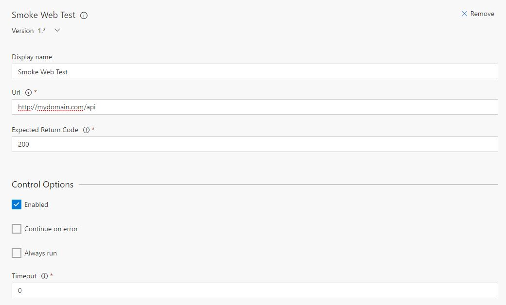

# Smoke Web Test Task

This is an extension for Visual Studio Team Services.

It adds a task that allows you to make a smoke web test.

## What is a smoke web test ?
Find [here](https://en.wikipedia.org/wiki/Smoke_testing_(software) wikipedia's definition.

Basically it's a simple http request to make sure everything is working (or at least responding).

You can also use it to pre-load your system before going live.

## Images

## Requirements
Since the task is executed by the build agent, your build machines has to have access to the website you are trying to call.

## Source
[GitHub](https://github.com/Duber/vsts-smoke-web-test-task)

## Issues
[File an issue](https://github.com/Duber/vsts-smoke-web-test-task/issues)

## Credits
[Miguel Cruz](http://www.miguelcruz.net)
